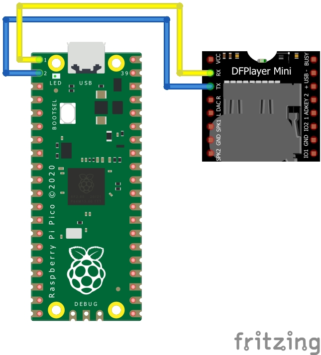

# ABOUT
This is a micropython class for DFPlayer mini mp3 player
## available methodes
- play()
- stop()
- play_next()
- play_previous()
- play_track(num)
- get_status()
## Usage
```python
from dfplayer import dfplayer

df = dfplayer(Pin(0), Pin(1))
df.play()
```

## wiring diagram




